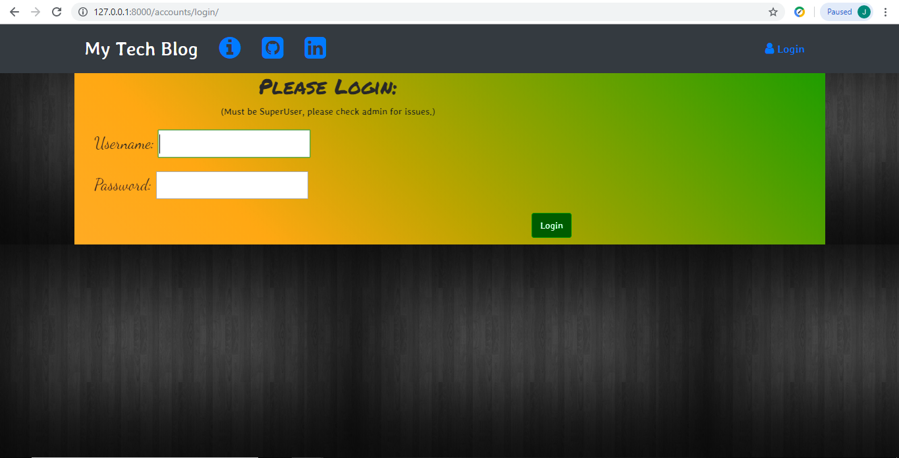
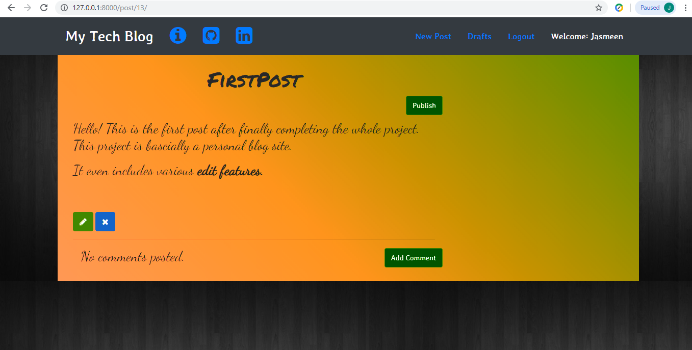
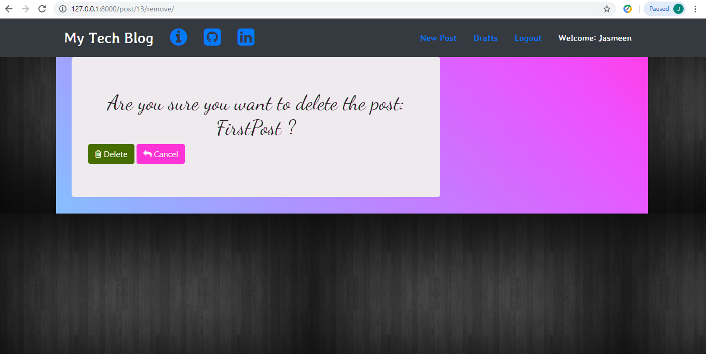

# BlogSiteClone

An attempt to create a clone of a Personal Blog Site using django deployment.
The Home Page is the list of all the published posts. You can add a post by logging in.The post is first created as a draft and then you can publish it. Features to edit and delete the post are available.
Comments can be added by anyone,but to be visible on the post they have to approved by user.

Home Page:

Login Page:

Draft View:

Medium Editor:

Delete Post:

